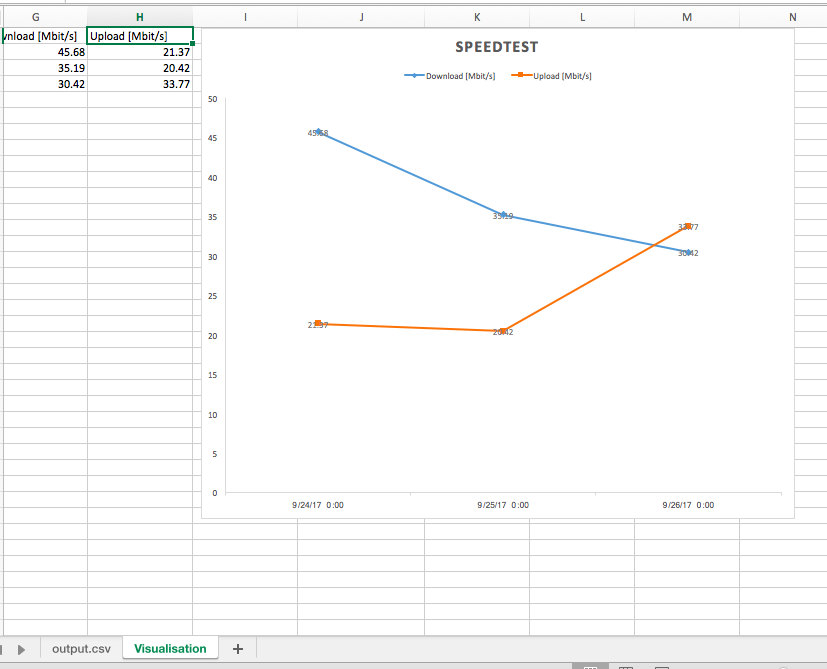

# Docker Speedtest with intervall
---

This Docker-Image runs the [speedtest-cli](https://github.com/sivel/speedtest-cli) every `n` seconds (environment var: `RUNEVERYNMINUTES`)

Default Vale ist set to 3600 seconds (= 1h) (`entrypoint.sh`)

The speedtest-cli config is set to `--csv`, so it logs all data as csv-string with an `,` as delimiter.

The data is also stored at `/data/output.csv`

example usage:

```
version: '2'
services:
  speedtest:
    build: .
    environment:
      RUNEVERYNMINUTES: 3600
    volumes:
    - /etc/localtime:/etc/localtime:ro
    - /data/speedtest:/data
```


---


you can also use the automated build `wasserball/speedtest-cli`

```
version: '2'
services:
  speedtest:
    image: wasserball/speedtest-cli
    environment:
    ...
```


The Timestamp in the CSV-Logs is in `ISO 8601` (UTC). [GitHub Issue](https://github.com/sivel/speedtest-cli/issues/387)

example Log:

```
Server ID,Sponsor,Server Name,Timestamp,Distance,Ping,Download,Upload
3840,ITandTEL,Wels,2017-09-25T21:24:32.337967Z,23.098684767922123,44.107,52541096.986188576,26523836.39776792
```

## Simple Visualisation

If you open the `result.xlsx` you get an error 

```
Security Warning: "Data Connections have been disabled".`
```

Click on `Enable Content`, and select the `/data/output.csv`-File.


