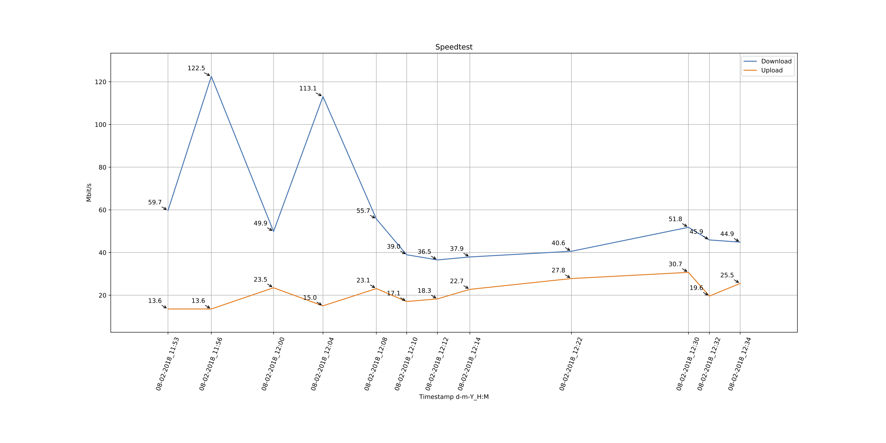

# Docker Speedtest with intervall
---

This Docker-Image runs the [speedtest-cli](https://github.com/sivel/speedtest-cli) every `n` seconds (environment var: `RUNEVERYNMINUTES`)

Default Vale ist set to 3600 seconds (= 1h) (`entrypoint.sh`)

Default Timezone is `Europe/Vienna` and can be overwritten with env variable `TIMEZONE` [List of timezones](https://en.wikipedia.org/wiki/List_of_tz_database_time_zones)

The speedtest-cli config is set to `--csv`, so it logs all data as csv-string with an `,` as delimiter.

The data is also stored at `/data/output.csv`

example usage:

```
version: '2'
services:
  speedtest:
    build: .
    environment:
      RUNEVERYNMINUTES: 3600
      TIMEZONE: Europe/Berlin
    volumes:
    - /data:/data
```
---


you can also use the automated build `wasserball/speedtest-cli`

```
version: '2'
services:
  speedtest:
    image: wasserball/speedtest-cli
    environment:
    ...
```


The Timestamp in the CSV-Logs is in `ISO 8601` (UTC). [GitHub Issue](https://github.com/sivel/speedtest-cli/issues/387)

example Log:

```
Server ID,Sponsor,Server Name,Timestamp,Distance,Ping,Download,Upload
3840,ITandTEL,Wels,2017-09-25T21:24:32.337967Z,23.098684767922123,44.107,52541096.986188576,26523836.39776792
```

##Visualisation
After every Speedtest, a PDF is created witch you can find under  `/data/result.pdf`


